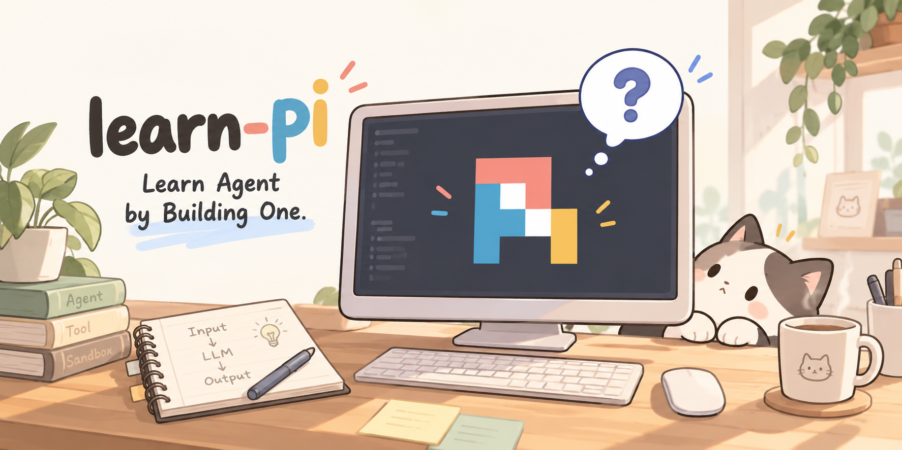

# learn-pi

**Learn Agent by building a micro Pi.**

亲手写一个 Agent，真正学会 Agent。

`Minimal · Transparent · Educational · Terminal-native`

---

## 📖 这是什么项目？

`learn-pi` 是一个面向 Agent 初学者的渐进式学习项目。

它不从大型框架开始，也不把 Agent 包装成黑盒，而是从一次最普通的 LLM 请求出发，每个版本只增加一个关键能力，最终亲手实现一个极简、透明、运行在终端中的 Coding Agent：`micro-pi`。

~~~text
一次 LLM 调用
    ↓
多轮对话
    ↓
Tool Calling
    ↓
Agent Loop
    ↓
Tool Registry
    ↓
Mini Coding Agent
    ↓
Session / Context / Skill / Sandbox / SubAgent ...
~~~

> 这个项目的目标不是“再造一个完整的 Pi”，而是借鉴 Pi 的极简思想，把 Agent 的核心机制一层一层拆开。

## ✨ 为什么要做 learn-pi？

使用 Agent 框架很容易，真正解释清楚它为什么能工作却不容易：

- 模型为什么能“记住”上一句话？
- Tool Call 是模型执行的吗？
- Tool Result 为什么还要发回给模型？
- Agent 和普通 ChatBot 的区别是什么？
- 为什么一段 `while` 循环会成为 Agent 的核心？
- Session、Context、Memory 分别是什么？

`learn-pi` 希望通过“少量代码 → 立即运行 → 观察现象 → 理解机制”的方式，让这些问题不再神秘。

项目始终遵循四个原则：

| 原则 | 含义 |
| --- | --- |
| **Minimal** | 每个版本只解决一个主要问题，不提前堆功能 |
| **Transparent** | 请求、消息、工具调用和循环过程都能直接看到 |
| **Educational** | 代码优先服务于理解，再考虑抽象与工程化 |
| **Terminal-native** | 聚焦 Agent Runtime，不让界面复杂度干扰学习 |

## 🚦 当前进度

当前已经完成并验收到 **V0.6 — Mini Coding Agent**，正在探索 **V0.7 — Session**。

| 版本 | 主题 | 这一版要回答的问题 | 状态 |
| --- | --- | --- | :---: |
| V0.1 | First LLM Call | 一次模型请求到底发生了什么？ | ✅ |
| V0.2 | Conversation | 模型为什么能记住前文？ | ✅ |
| V0.3 | Tool Calling | 模型如何提出工具调用请求？ | ✅ |
| V0.4 | Agent Loop | 如何持续调用工具直到任务完成？ | ✅ |
| V0.5 | Tool Registry | 工具变多后如何统一管理？ | ✅ |
| V0.6 | Mini Coding Agent | 如何让 Agent 读、写、改文件并执行命令？ | ✅ |
| V0.7 | Session | 程序关闭后如何继续上次对话？ | ✅ |
| V0.8 | Context Compaction | 上下文太长时怎么办？ | 🚧 |
| V0.9 | Skill | 如何按需加载可复用的领域知识？ | 🗓️ |
| V0.10 | Extension | 如何扩展 Runtime 而不污染核心？ | 🗓️ |
| V0.11 | Event & Streaming | 如何展示 Agent 的运行过程？ | 🗓️ |
| V0.12 | Sandbox | 如何限制工具执行的风险？ | 🗓️ |
| V0.13 | SubAgent | 如何把任务拆给多个 Agent？ | 🗓️ |
| V0.14 | Durable Run | Agent 中断后如何恢复执行？ | 🗓️ |
| V1.0 | micro-pi Core | 如何形成一个完整、可解释的 Agent Core？ | 🗓️ |

> `✅ 已完成` · `🚧 进行中` · `🗓️ 计划中`
>
> V0.7 当前仍是开发快照，尚未完成 Session 能力验收。

## 🚀 快速开始

### 1. 准备环境

- Python 3.12（项目当前开发环境）
- 一个提供 `/chat/completions` 接口的 OpenAI-compatible 模型服务
- 从 V0.3 开始，模型还需要支持 Tool Calling

克隆项目：

~~~bash
git clone https://github.com/tutu-zzz/learn-pi.git
cd learn-pi
~~~

Windows PowerShell：

~~~powershell
python -m venv .venv
.\.venv\Scripts\Activate.ps1
python -m pip install -r requirements.txt
Copy-Item .env.example .env
~~~

macOS / Linux：

~~~bash
python3 -m venv .venv
source .venv/bin/activate
python -m pip install -r requirements.txt
cp .env.example .env
~~~

### 2. 配置模型

打开项目根目录中的 `.env`：

~~~dotenv
MICRO_PI_BASE_URL=https://your-provider.example/v1
MICRO_PI_MODEL=your-model-name
MICRO_PI_API_KEY=your-api-key
~~~

| 配置项 | 作用 | 示例 |
| --- | --- | --- |
| `MICRO_PI_BASE_URL` | 模型服务的 API 根地址，不包含 `/chat/completions` | `https://api.example.com/v1` |
| `MICRO_PI_MODEL` | 服务商提供的模型名称 | `your-model-name` |
| `MICRO_PI_API_KEY` | API 访问密钥 | `your-api-key` |

> 🔐 `.env` 已被 Git 忽略。请勿把真实 API Key 写入源码、截图或提交记录。

### 3. 从第一版开始运行

~~~bash
python learning-versions/01_v0.1_first_llm_call/main.py
~~~

输入一条消息：

~~~text
> 你好，请用一句话介绍 Agent。
Answer: ...
~~~

V0.1 跑通后，再依次运行后面的版本：

~~~bash
python learning-versions/02_v0.2_conversation/main.py
python learning-versions/03_v0.3_tool_calling/main.py
python learning-versions/04_v0.4_agent_loop/main.py
python learning-versions/05_v0.5_tool_registry/main.py
python learning-versions/06_v0.6_mini_coding_agent/main.py
~~~

对话版本中输入 `/exit` 可以退出程序。

## 🧠 Agent 到底是怎么工作的？

从 V0.4 开始，`micro-pi` 已经具备最小 Agent Loop：

~~~mermaid
flowchart LR
    U["用户输入"] --> R["Agent Runtime"]
    R --> L["LLM"]
    L -->|"Final Answer"| O["输出回答"]
    L -->|"Tool Call"| T["Tool Registry"]
    T --> E["Python 执行工具"]
    E -->|"Tool Result"| R
~~~

最关键的认知是：

1. **模型不会亲自执行工具。** 模型只生成结构化的 Tool Call。
2. **Python Runtime 才是真正的执行者。** 它解析参数、调用函数并得到结果。
3. **工具结果需要返回给模型。** 模型拿到真实结果后，才能决定继续调用工具还是给出最终回答。
4. **Agent Loop 负责重复这个过程。** 直到模型不再请求工具，本轮任务才结束。

最小逻辑可以理解为：

~~~python
while True:
    assistant_message = call_model(messages)

    if not assistant_message.get("tool_calls"):
        print(assistant_message["content"])
        break

    for tool_call in assistant_message["tool_calls"]:
        tool_result = execute_tool(tool_call)
        messages.append(tool_result)
~~~

这段循环并不等于完整的生产级 Agent，但它已经揭示了 Agent 最核心的运行机制。

## 🗺️ 推荐学习方式

不要直接打开最新版本。建议每一版都按下面的顺序学习：

1. **先运行上一版**：确认它已经能做什么。
2. **再提出新问题**：例如“工具多了以后，`if/elif` 会不会越来越长？”
3. **只看本版新增内容**：代码中的 `[V0.x 新增]` 和 `[V0.x 修改]` 注释会标出变化。
4. **亲手输入测试任务**：观察终端中的 Message、Tool Call 和 Tool Result。
5. **尝试删掉关键代码**：看看现象如何变化，再解释为什么。
6. **最后阅读下一版**：带着问题理解新抽象，而不是背结论。

每学完一个版本，至少尝试回答三个问题：

- 这一版解决了上一版的什么问题？
- 新增能力由模型、Runtime 还是工具负责？
- 如果删掉这部分代码，用户能观察到什么变化？

### 各版本入口

| 版本 | 代码快照 | 建议观察 |
| --- | --- | --- |
| V0.1 | [第一次 LLM 调用](learning-versions/01_v0.1_first_llm_call/main.py) | URL、Headers、Messages、Response |
| V0.2 | [多轮对话](learning-versions/02_v0.2_conversation/main.py) | `messages` 为什么要放在循环外 |
| V0.3 | [Tool Calling](learning-versions/03_v0.3_tool_calling/main.py) | Tool Schema、Tool Call、Tool Result |
| V0.4 | [Agent Loop](learning-versions/04_v0.4_agent_loop/main.py) | 外层对话循环与内层 Agent Loop |
| V0.5 | [Tool Registry](learning-versions/05_v0.5_tool_registry/main.py) | 工具说明与执行函数如何统一注册 |
| V0.6 | [Mini Coding Agent](learning-versions/06_v0.6_mini_coding_agent/main.py) | `read`、`write`、`edit`、`bash` 的边界 |
| V0.7 | [Session 开发快照](learning-versions/07_v0.7_session/main.py) | 当前仍待实现持久化与恢复 |

## 🧰 V0.6 能做什么？

V0.6 注册了四个 Coding Tools：

| Tool | 能力 |
| --- | --- |
| `read` | 读取工作目录中的文本文件 |
| `write` | 创建或覆盖文件 |
| `edit` | 将指定文本替换一次 |
| `bash` | 在工作目录中执行 Shell 命令 |

可以尝试这样的任务：

~~~text
> 创建 hello.py，让它输出 Hello, micro-pi!，然后运行它。
~~~

运行时重点观察：

~~~text
用户任务
  → 模型生成 Tool Call
  → Tool Registry 找到执行函数
  → Python 执行工具
  → Tool Result 写回 messages
  → 模型继续判断
  → 输出最终回答
~~~

> ⚠️ **安全提示：V0.6 还不是 Sandbox。**
>
> `read / write / edit` 会限制路径不越出启动程序时的工作目录，但 `bash` 使用系统 Shell 执行模型生成的命令，并不具备完整隔离能力。请只在测试目录、临时项目或其他可恢复环境中学习，不要在包含敏感数据的重要目录中运行，也不要使用高权限账户。

## 📁 项目结构

~~~text
learn-pi/
├── docs/
│   ├── assets/
│   │   └── learn-pi-cover.png
│   ├── learn-pi_-_micro-pi_PRD.md   # 完整产品与学习路线
│   └── 进度.md                       # 已验收版本记录
├── learning-versions/
│   ├── 01_v0.1_first_llm_call/
│   ├── 02_v0.2_conversation/
│   ├── 03_v0.3_tool_calling/
│   ├── 04_v0.4_agent_loop/
│   ├── 05_v0.5_tool_registry/
│   ├── 06_v0.6_mini_coding_agent/
│   └── 07_v0.7_session/
├── src/
│   └── micro_pi/
│       └── main.py                  # 主学习工作区，会随开发推进
├── .env.example
├── requirements.txt
└── README.md
~~~

`learning-versions/` 保存每个阶段的独立代码快照。旧版本不会继续叠加修改，因此可以清楚地比较 Agent 是怎样一步一步长出来的。

## 🩺 常见问题

### 提示“模型配置不完整”

确认根目录下存在 `.env`，并且以下三项都不是空值：

~~~text
MICRO_PI_BASE_URL
MICRO_PI_MODEL
MICRO_PI_API_KEY
~~~

### 返回 401 或 403

通常表示 API Key 无效、过期，或当前账户没有访问该模型的权限。

### 返回 404

检查 `MICRO_PI_BASE_URL`。代码会自动在它后面拼接 `/chat/completions`，因此不要把完整接口路径重复写入配置。

### V0.3 之后模型不调用工具

确认所选模型及服务端兼容 Chat Completions 的 Tool Calling 格式。部分模型只能普通对话，无法生成项目所需的 `tool_calls`。

### PowerShell 不允许激活虚拟环境

可以不激活环境，直接使用虚拟环境中的 Python：

~~~powershell
.\.venv\Scripts\python.exe -m pip install -r requirements.txt
.\.venv\Scripts\python.exe learning-versions\01_v0.1_first_llm_call\main.py
~~~

## 📚 延伸阅读

- [完整 PRD：项目定位、设计原则与长期路线](docs/learn-pi_-_micro-pi_PRD.md)
- [项目进度：各版本验收记录](docs/进度.md)
- [学习版本归档说明](learning-versions/README.md)

## 🤝 参与项目

欢迎通过 Issue 或 Pull Request 交流：

- 某个概念是否还能讲得更直白
- 某一步是否对初学者跳跃过大
- 示例、注释或错误提示是否可以改进
- 新版本是否仍然遵循“一个阶段只引入一个主要概念”

如果你正在跟学，也欢迎记录自己的问题。一个“看起来很基础”的问题，往往正是教程最值得补充的地方。

## 📄 License

本项目基于 [MIT License](LICENSE) 开源。

---

**Agent 不是魔法。它只是由一组可以理解、可以实现、可以观察的机制组合而成。**

