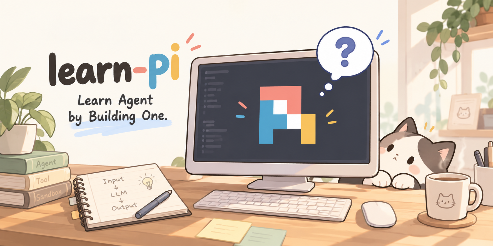

# learn-pi

**Learn Agent by building a micro Pi.**

亲手写一个 Agent，真正学会 Agent。

`Minimal · Transparent · Educational · Terminal-native`

<strong>Agent 不是魔法。</strong> 它只是由一组可以理解、可以实现、可以观察的机制组合而成。

---

## 📖 这是什么项目？

`learn-pi` 是一个面向 Agent 初学者的渐进式学习项目。

它不从大型框架开始，也不把 Agent 包装成黑盒，而是从一次最普通的 LLM 请求出发，每个版本只增加一个关键能力，最终亲手实现一个极简、透明、运行在终端中的 Coding Agent：`micro-pi`。

~~~text
一次 LLM 调用
    ↓
多轮对话
    ↓
Tool Calling
    ↓
Agent Loop
    ↓
Tool Registry
    ↓
Coding Agent
    ↓
Session / Context / Skill / Extension / Event / Sandbox / SubAgent
    ↓
Durable Run / micro-pi Core
~~~

> 这个项目的目标不是“再造一个完整的 Pi”，而是借鉴 Pi 的极简思想，把 Agent 的核心机制一层一层拆开。

## ✨ 为什么要做 learn-pi？

使用 Agent 框架很容易，真正解释清楚它为什么能工作却不容易：

- 模型为什么能“记住”上一句话？
- Tool Call 是模型执行的吗？
- Tool Result 为什么还要发回给模型？
- Agent 和普通 ChatBot 的区别是什么？
- 为什么一段 `while` 循环会成为 Agent 的核心？
- Session、Context、Memory 分别是什么？

`learn-pi` 希望通过“少量代码 → 立即运行 → 观察现象 → 理解机制”的方式，让这些问题不再神秘。

| 原则 | 含义 |
| --- | --- |
| **Minimal** | 每个版本只解决一个主要问题，不提前堆功能 |
| **Transparent** | 请求、消息、工具调用和运行过程都能直接看到 |
| **Educational** | 代码优先服务于理解，再考虑抽象与工程化 |
| **Terminal-native** | 聚焦 Agent Runtime，不让界面复杂度干扰学习 |

## 🚦 当前进度

当前已经完成并验收到 **V1.0 — micro-pi Core**，完成从一次模型调用到模块化终端 Agent 的第一轮学习。Streaming 不影响 Agent 核心能力，暂时作为可选增强保留。

| 版本 | 主题 | 状态 |
| --- | --- | :---: |
| V0.1 | First LLM Call | ✅ |
| V0.2 | Conversation | ✅ |
| V0.3 | Tool Calling | ✅ |
| V0.4 | Agent Loop | ✅ |
| V0.5 | Tool Registry | ✅ |
| V0.6 | Mini Coding Agent | ✅ |
| V0.7 | Session | ✅ |
| V0.8 | Context Compaction | ✅ |
| V0.9 | Skill | ✅ |
| V0.10 | Extension | ✅ |
| V0.11 | Event（Streaming 可选） | ✅ |
| V0.12 | Sandbox | ✅ |
| V0.13 | SubAgent | ✅ |
| V0.14 | Durable Run | ✅ |
| V1.0 | micro-pi Core | ✅ |

> `✅ 已完成` · `🚧 进行中` · `🗓️ 计划中`

### 📚 版本学习入口

每个已完成版本的目标、流程、运行方法和观察重点已集中整理：

> **[查看 V0.1–V1.0 版本说明 →](learning-versions/README.md)**

结课后可把 Agent 安装为 `micro-pi` 命令，或下载同一版本的 wheel 体验。[V1.1 独立打包章节](learning-versions/16_v1.1_cli/README.md)

## 🚀 快速开始

### 1. 准备环境

- Python 3.12（项目当前开发环境）
- 一个提供 `/chat/completions` 接口的 OpenAI-compatible 模型服务
- 从 V0.3 开始，模型还需要支持 Tool Calling

克隆项目：

~~~bash
git clone https://github.com/tutu-zzz/learn-pi.git
cd learn-pi
~~~

Windows PowerShell（Conda）：

~~~powershell
conda create -n learn-pi python=3.12 pip
conda activate learn-pi
python -m pip install -r requirements.txt
Copy-Item .env.example .env
~~~

macOS / Linux（Conda）：

~~~bash
conda create -n learn-pi python=3.12 pip
conda activate learn-pi
python -m pip install -r requirements.txt
cp .env.example .env
~~~

### 2. 配置模型

打开项目根目录中的 `.env`：

~~~dotenv
MICRO_PI_BASE_URL=https://your-provider.example/v1
MICRO_PI_MODEL=your-model-name
MICRO_PI_API_KEY=your-api-key
~~~

| 配置项 | 作用 |
| --- | --- |
| `MICRO_PI_BASE_URL` | 模型服务的 API 根地址，不包含 `/chat/completions` |
| `MICRO_PI_MODEL` | 服务商提供的模型名称 |
| `MICRO_PI_API_KEY` | API 访问密钥 |

> 🔐 `.env` 已被 Git 忽略。请勿把真实 API Key 写入源码、截图或提交记录。

如果已经配置过 `.env`，保留现有文件，只修改需要更换的字段。模型名称以服务商提供且账号可用的名称为准。

本机曾出现经代理请求 DeepSeek 时的 SSL EOF，而直连成功。如果遇到相同情况，先检查网络与代理；确认该域名可直连后，可以在 `.env` 中添加 `NO_PROXY=api.deepseek.com`。这是可选的本地网络设置，不是所有模型服务的通用要求。

### 3. 运行项目

第一次学习建议从 V0.1 开始：

~~~bash
python learning-versions/01_v0.1_first_llm_call/main.py
~~~

输入一条消息：

~~~text
> 你好，请用一句话介绍 Agent。
Answer: ...
~~~

如果希望体验当前最新的完整版本：

~~~bash
python learning-versions/15_v1.0_micro_pi_core/main.py
~~~

对话中输入 `/exit` 可以退出程序。其余版本的运行方式与学习重点请查看[版本学习指南](learning-versions/README.md)。

请从项目根目录运行。V1.0 默认追加到 `sessions/session-013-parent.jsonl`，Child 分别写入 Explorer / Comparator Session；任务状态保存在 `runs/run-013.json`。重启会读取 Parent 历史，并自动继续 `RUNNING` 或 `WAITING_TOOL` 任务。修改会话路径做独立实验时，需要配套修改 Checkpoint 路径。

### 4. V1.0 模块与实现边界

| 模块 | 职责 |
| --- | --- |
| `main.py` | 配置、工具实现、Skill / Extension 加载、对象组装和终端输入 |
| `provider.py` | 统一 Parent、摘要和 Child 的模型请求 |
| `session.py` | 加载和追加完整消息历史 |
| `context.py` | 管理当前上下文，压缩旧消息并保留近期轮次 |
| `tool_registry.py` | 注册和查找工具，生成模型可见 Schema |
| `runtime.py` | 保存消息、开始任务、执行 Agent Loop、读取和更新 Checkpoint |
| `renderer.py` | 将运行事件显示到终端 |
| `sandbox.py` / `subagent.py` / `durable.py` | 工具权限、受限 Child Agent 和最小 Checkpoint 持久化 |

Parent 默认允许 `read`、`write`、`edit`、`word_count` 和两类委托工具；`bash` 已注册但不在允许执行的白名单中。Child 只使用 `read`，按顺序执行，历史记录不会在下一次委托时自动恢复。文件工具检查 Workspace 路径，Sandbox 本身只检查工具名，未提供操作系统级隔离。

Streaming、网络自动重试、工具幂等执行和逐个工具恢复进度尚未实现，属于后续增强。

## 🧠 Agent 到底是怎么工作的？

从 V0.4 开始，`micro-pi` 已经具备最小 Agent Loop：

~~~mermaid
flowchart LR
    U["用户输入"] --> R["Agent Runtime"]
    R --> L["LLM"]
    L -->|"Final Answer"| O["输出回答"]
    L -->|"Tool Call"| T["Tool Registry"]
    T --> E["Python 执行工具"]
    E -->|"Tool Result"| R
~~~

最关键的认知是：

1. **模型不会亲自执行工具。** 模型只生成结构化的 Tool Call。
2. **Python Runtime 才是真正的执行者。** 它解析参数、调用函数并得到结果。
3. **工具结果需要返回给模型。** 模型拿到真实结果后，才能决定继续调用工具还是给出最终回答。
4. **Agent Loop 负责重复这个过程。** 直到模型不再请求工具，本轮任务才结束。
5. **SubAgent 也是受控的工具调用。** V0.13 中 Parent 通过委托工具启动独立 Child；Child 使用自己的 Messages、Session 和只读工具，结果再作为 Tool Result 返回 Parent。

最小逻辑可以理解为：

~~~python
while True:
    assistant_message = call_model(messages)

    if not assistant_message.get("tool_calls"):
        print(assistant_message["content"])
        break

    for tool_call in assistant_message["tool_calls"]:
        tool_result = execute_tool(tool_call)
        messages.append(tool_result)
~~~

这段循环并不等于完整的生产级 Agent，但它已经揭示了 Agent 最核心的运行机制。

## 🗺️ 推荐学习方式

不要直接阅读最终版本。建议每一版都按下面的顺序学习：

1. **先运行上一版**：确认它已经能做什么。
2. **再提出新问题**：理解为什么需要增加下一个能力。
3. **只看本版新增内容**：代码中的 `[V0.x 新增]` / `[V0.x 修改]` 和 `[V1.0 新增]` / `[V1.0 修改]` 会标出变化。
4. **亲手输入测试任务**：观察 Message、Tool Call、Tool Result 和 Event。
5. **尝试删掉关键代码**：根据运行变化解释它的职责。
6. **最后进入下一版**：带着问题理解新抽象，而不是背结论。

每学完一个版本，尝试回答：

- 这一版解决了上一版的什么问题？
- 新增能力由模型、Runtime 还是工具负责？
- 如果删掉这部分代码，用户能观察到什么变化？

具体学习路径请从[可折叠版本说明](learning-versions/README.md)中按顺序展开。

## 📁 项目结构

~~~text
learn-pi/
├── docs/
│   ├── assets/
│   │   └── learn-pi-cover.png
│   ├── learn-pi_-_micro-pi_PRD.md
│   └── 进度.md
├── learning-versions/
│   ├── assets/                       # V0.1–V0.13 宏观流程图
│   ├── 01_v0.1_first_llm_call/main.py
│   ├── 02_v0.2_conversation/main.py
│   ├── 03_v0.3_tool_calling/main.py
│   ├── 04_v0.4_agent_loop/main.py
│   ├── 05_v0.5_tool_registry/main.py
│   ├── 06_v0.6_mini_coding_agent/main.py
│   ├── 07_v0.7_session/main.py
│   ├── 08_v0.8_context_compaction/main.py
│   ├── 09_v0.9_skill/
│   │   ├── main.py
│   │   └── skills/code-review/SKILL.md
│   ├── 10_v0.10_extension/
│   │   ├── main.py
│   │   ├── extensions/word_count.py
│   │   └── skills/code-review/SKILL.md
│   ├── 11_v0.11_event_and_streaming/
│   │   ├── main.py
│   │   ├── renderer.py
│   │   ├── extensions/word_count.py
│   │   └── skills/code-review/SKILL.md
│   ├── 12_v0.12_sandbox/
│   │   ├── main.py
│   │   ├── sandbox.py
│   │   ├── renderer.py
│   │   ├── extensions/word_count.py
│   │   ├── skills/code-review/SKILL.md
│   │   └── test/                     # 仅用于 Sandbox 对比实验
│   │       ├── protected/private_config.txt
│   │       └── backup/private_config.backup.txt
│   ├── 13_v0.13_subagent/
│   │   ├── main.py                   # Parent Agent、Registry 与委托工具
│   │   ├── subagent.py               # Child Agent Loop 与独立 Session
│   │   ├── sandbox.py
│   │   ├── renderer.py
│   │   ├── extensions/word_count.py
│   │   └── skills/code-review/SKILL.md
│   ├── 14_v0.14_durable_run/         # Durable Run 快照
│   ├── 15_v1.0_micro_pi_core/        # 模块化 Agent Core
│   │   ├── main.py                 # 启动组装和终端循环
│   │   ├── runtime.py              # Agent Loop 与任务状态
│   │   ├── provider.py
│   │   ├── session.py
│   │   ├── context.py
│   │   ├── tool_registry.py
│   │   ├── durable.py
│   │   ├── renderer.py
│   │   ├── sandbox.py
│   │   ├── subagent.py
│   │   ├── extensions/word_count.py
│   │   └── skills/code-review/SKILL.md
│   └── README.md                     # 版本学习指南
├── sessions/                         # 运行时生成，已被 Git 忽略
├── runs/                             # Checkpoint，已被 Git 忽略
├── src/
│   └── micro_pi/
│       └── main.py                   # 保留的早期学习工作区，非 V1.0 入口
├── .env.example
├── .gitignore
├── LICENSE
├── requirements.txt
└── README.md
~~~

`learning-versions/` 保存每个阶段的独立代码快照。旧版本不会继续叠加修改，因此可以清楚地比较 Agent 是怎样一步一步成长的。

## 📚 延伸阅读

- [版本学习指南：按需展开每个版本](learning-versions/README.md)
- [完整 PRD：项目定位、设计原则与长期路线](docs/learn-pi_-_micro-pi_PRD.md)
- [项目进度：各版本验收记录](docs/进度.md)

## 🤝 参与项目

欢迎通过 Issue 或 Pull Request 交流：

- 某个概念是否还能讲得更直白
- 某一步是否对初学者跳跃过大
- 示例、注释或错误提示是否可以改进
- 新版本是否仍然遵循“一个阶段只引入一个主要概念”

如果你正在跟学，也欢迎记录自己的问题。一个“看起来很基础”的问题，往往正是教程最值得补充的地方。

## 📄 License

本项目基于 [MIT License](LICENSE) 开源。
